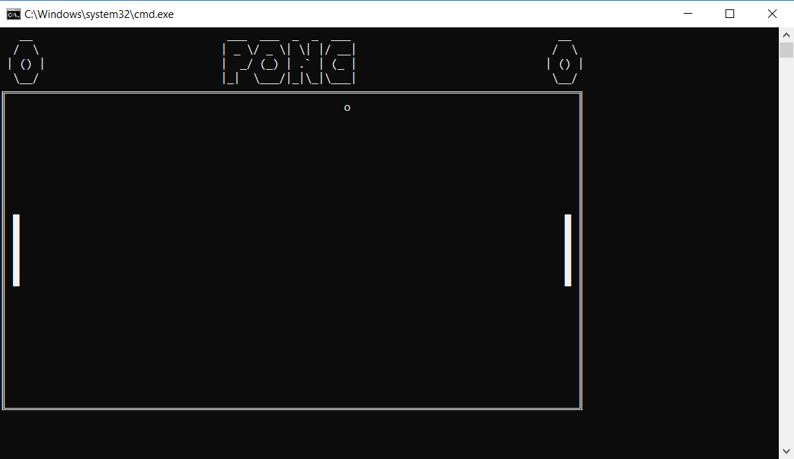
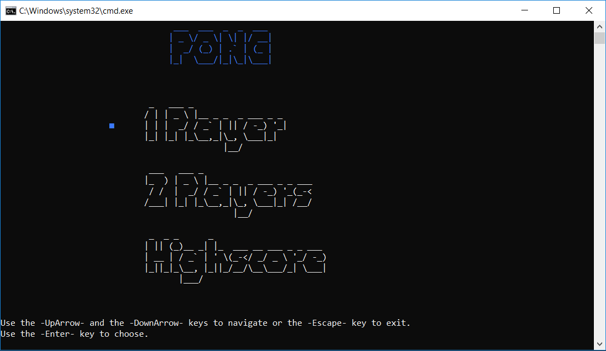
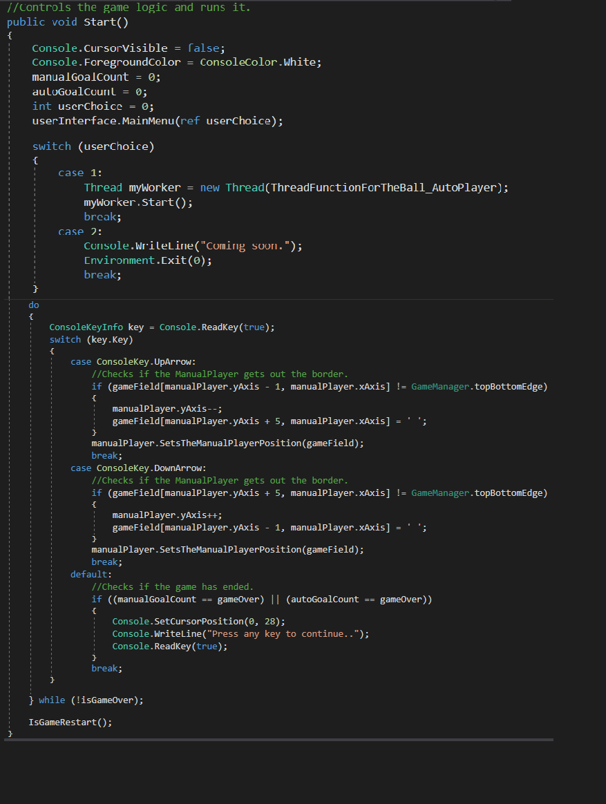

# Classic Pong :rocket:

This is a pong game written with visual studio, C# programming, console application.
Pong is one of the earliest arcade video games. It is a table tennis sports game featuring simple two-dimensinal graphics.

## Final year project
This project was for my first year final project.
We had different options between which project to choose, I guess I was choosing Pong because it felt the right one for me.

## Build status
The game currently has 2 out of 3 options:
- [x] 1 Player.
- [ ] 2 Players.
- [x] High score.

Will update when the new feature will be ready.
'''
current date: 07-NOV-18
'''

## Code style
C# :v:

## Screenshots

## Tech/Framework used
Visual Studio 2017 :boom:

## Code Example

## Credits
A huge thank to © [ShayRubach](https://github.com/ShayRubach) :point_left: who helped me a lot!
